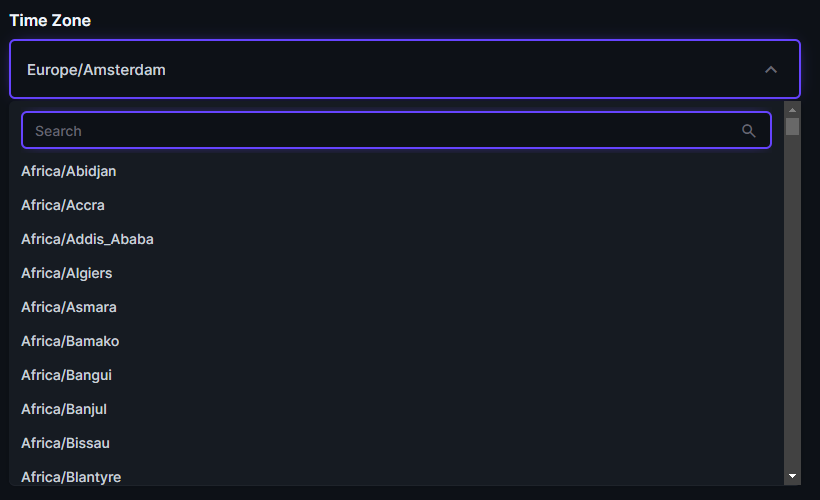

# Introduction
A [Directus](https://github.com/directus/directus) interface extension for time zones.

## Installation

This package is published in the Directus marketplace.

## How to use
1. Go to **Settings**, create a new field with type `input`.
2. In the **Interface** panel, choose **Time Zones** interface.

## Disclaimer
This is our first Directus extensions. PR's are welcome!